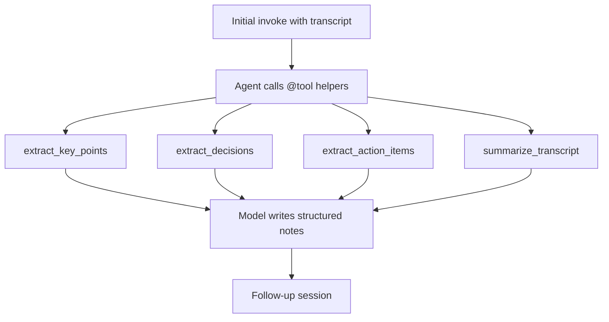

# Plan 002: Improve tool functions and tool calls

Status: **implemented**  
Related code: [`tools.py`](../../tools.py), [`main.py`](../../main.py), [`README.md`](../../README.md)

> Naming: plans in this folder use a numeric prefix (`001-`, `002-`, …) so later plans can be added without collisions.

---

## Problem

Current tools in `tools.py` were plain functions registered in `main.py` `build_agent()`:

```python
tools = [extract_key_points, extract_action_items, preview_transcript]
```

Gaps that reduce tool effectiveness:

- No `@tool` decorator → weaker/less explicit name, description, and args schema for the model
- Docstrings lack `Args:` / when-to-use guidance
- Keyword heuristics are brittle; `preview_transcript` rarely helps for full-transcript analysis
- Instructions list 4 note sections, but tools do not map cleanly (no dedicated decisions/summary tools)
- System prompt only says “use tools when they help” — too soft for reliable tool calling
- Initial invoke already pastes the full transcript, so the model can skip tools entirely

## Chosen approach

Keep helper tools (not LLM-only). Convert them with `@tool` from `langchain.tools`, add one tool per notes section that benefits from extraction, strengthen docstrings/schemas, and update the system + initial prompts so the first draft **must** call extraction tools before writing the final notes.



## Step-by-step changes

### Step 1 — Convert existing helpers to `@tool`

In `tools.py`:

- Import `@tool` from `langchain.tools` (LangChain 1.x style used with `create_agent`)
- Keep type hints on every parameter (required for schema)
- Write docstrings that state **when** to call the tool and document `Args`

### Step 2 — Align tools with note sections

| Notes section | Tool |
|---------------|------|
| Key discussion points | `extract_key_points` (improved keywords / line scoring) |
| Decisions | **Add** `extract_decisions` |
| Action items | `extract_action_items` (improved ownership patterns) |
| Summary | **Replace** `preview_transcript` with `summarize_transcript` |

Export `MEETING_TOOLS = [...]`, imported by `main.py`.

### Step 3 — Improve tool implementations

- Shared private helper `_filter_lines(text, keywords) -> str`
- Broader, section-specific keyword sets; return numbered candidate lines
- Empty results: explicit `"No … found in transcript."` strings
- Keep tools pure (input text → string); no file I/O

### Step 4 — Wire tools in `main.py`

- `from tools import MEETING_TOOLS`
- `create_agent(..., tools=MEETING_TOOLS, ...)`
- Update `SYSTEM_PROMPT` to require tool use for the first draft

### Step 5 — Make the initial instruction force tool use

Update `INITIAL_NOTES_INSTRUCTION` to tell the model to call extraction tools first, then compose the four sections.

### Step 6 — Verify tool calls at runtime

- Confirm tool schemas / `@tool` registration
- Run a non-interactive agent invoke and confirm tool messages appear
- Update `README.md` briefly

### Step 7 — Optional observability

- Print which tools ran during the initial draft (lightweight)

## Out of scope

- Persistent memory / new checkpointer backends
- Structured JSON output schema for the whole notes document
- Replacing heuristics with a second LLM call inside each tool

## Progress tracker

- [x] Write this plan file
- [x] `@tool` conversion + new tools + `MEETING_TOOLS`
- [x] Prompt + wiring updates in `main.py`
- [x] Runtime verification + README (all four tools called on first draft)
